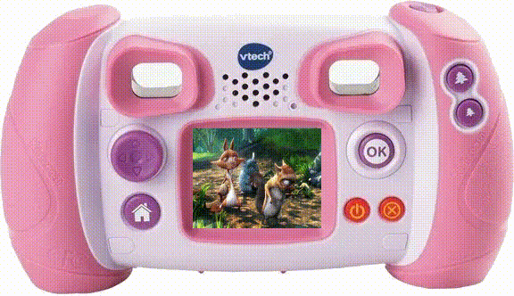

# Convert any videos for your kid's VTech&reg; KidiZoom&reg; Kid Connect :rainbow: :sparkles:
The goal of this page is to explain how to convert any videos to your kid's camcorder :video_camera: **VTech&reg; KidiZoom&reg; Kid Connect** from [VTech](https://www.vtech.com/). So then your kids can watch their favorite video clips like the [Baby Shark Dance](https://www.youtube.com/watch?v=XqZsoesa55w) :baby::shark: and then you will be the best daddy/mummy of their world :unicorn::rainbow::sparkles:...

.


Note: the above video example is the famous [Big Buck Bunny](https://studio.blender.org/films/big-buck-bunny/?asset=263) from [Blender Studio](https://studio.blender.org) under the license [CC-BY](https://creativecommons.org/licenses/by/4.0/), converted to fit the size of the animated gif, more details [below](#extra).

# Table of contents
<!-- @import "[TOC]" {cmd="toc" depthFrom=2 depthTo=6 orderedList=false} -->

<!-- code_chunk_output -->

- [Get the KidiZoom&reg; audio & video codec parameters](#get-the-kidizoomreg-audio-video-codec-parameters)
- [Convert videos to KidiZoom&reg; avi video files](#convert-videos-to-kidizoomreg-avi-video-files)
- [Convert audios to KidiZoom&reg; wav audio files](#convert-audios-to-kidizoomreg-wav-audio-files)
- [Extra: Use ffmpeg for creating the animated gif](#extra-use-ffmpeg-for-creating-the-animated-gif)
- [Any questions or comments are welcome :bird:](#any-questions-or-comments-are-welcome-bird)

<!-- /code_chunk_output -->

## Get the KidiZoom&reg; audio & video codec parameters
The [ffmpeg](https://www.ffmpeg.org/) wonderful tool is used to get audio and video codec parameters

``` bash
# get audio codec information
$ ffprobe -hide_banner references/VOICE/V0110.WAV
Input #0, wav, from 'references/VOICE/V0110.WAV':
  Duration: 00:00:04.64, bitrate: 352 kb/s
    Stream #0:0: Audio: pcm_s16le ([1][0][0][0] / 0x0001), 22050 Hz, 1 channels, s16, 352 kb/s

# get video codec information
$ ffprobe -hide_banner references/DCIM/100VTECH/100_0010.AVI
Input #0, avi, from 'references/DCIM/100VTECH/100_0010.AVI':
  Metadata:
    ISRC            : Generplus
    artist          : Generplus
    copyright       : Generplus
    date            : 2010-06-29
  Duration: 00:00:02.80, start: 0.000000, bitrate: 1423 kb/s
    Stream #0:0: Video: mjpeg (MJPG / 0x47504A4D), yuvj422p(pc, bt470bg/unknown/unknown), 320x240, 1196 kb/s, 15 fps, 15 tbr, 15 tbn, 15 tbc
    Stream #0:1: Audio: pcm_s16le ([1][0][0][0] / 0x0001), 22050 Hz, 1 channels, s16, 352 kb/s
```

> **Note** On Ubuntu-like Linux distribution, install ffmpeg with the command ```sudo apt-get install ffmpeg```

## Convert videos to KidiZoom&reg; avi video files
``` bash
# IMPORTANT Please adjust input and output filenames below
export input_filename="your_input_video_filename_with_extension"
export output_filename="100_0042.AVI"

# IMPORTANT you may need to adjust -q:v for having around 1.3Mbits/s)
export video="-vcodec mjpeg -vf scale=320:240 -r 15 -pix_fmt yuvj422p -q:v 4"
export audio="-acodec pcm_s16le -ar 22050 -ac 1"
export extra="-map_metadata -1 -fflags +bitexact -metadata ISRC=Generplus -metadata artist=Generplus -metadata copyright=Generplus -metadata date=2010-06-29 -y"
ffmpeg -i ${input_filename} ${video} ${audio} ${extra} ${output_filename}
```

## Convert audios to KidiZoom&reg; wav audio files
``` bash
# IMPORTANT Please adjust input and output filenames below
export input_filename="your_input_audio_filename_with_extension"
export output_filename="V0042.WAV"

# mono, 22050Hz, pcm signed 16bit little endian, no metadata
export filename="your_input_audio_filename_with_extension"
export audio="-acodec pcm_s16le -ar 22050 -ac 1"
export extra="-map_metadata -1 -fflags +bitexact -y"
ffmpeg -i ${input_filename} ${audio} ${extra} ${output_filename}
```

## Extra: Use ffmpeg for creating the animated gif
<a name="extra"></a>The animated gif example has been created with the following commands:
``` bash
wget https://upload.wikimedia.org/wikipedia/commons/transcoded/c/c0/Big_Buck_Bunny_4K.webm/Big_Buck_Bunny_4K.webm.480p.webm

# IMPORTANT Please adjust input and output filenames below
export background_image_filename="images/kidizoom_back.png"
export input_filename="Big_Buck_Bunny_4K.webm.480p.webm"
export output_filename="images/kidizoom_back_with_video.gif"

# we keep only 20s, seeking first to 318s, resize to 144x112, only 10fps
ffmpeg -ss 318 -t 20 -i ${input_filename} -vf "fps=10,scale=144x112:flags=lanczos,split[s0][s1];[s0]palettegen[p];[s1][p]paletteuse" -loop 0 tmp.gif

# we add a background and put the gif video at (216, 144)
ffmpeg -t 20 -loop 1 -i ${background_image_filename} -i tmp.gif -filter_complex "overlay=216:144" -loop 0 ${output_filename}
```

> **Note** video to gif command inspired from the article [How do I convert a video to GIF using ffmpeg, with reasonable quality?](https://superuser.com/questions/556029/how-do-i-convert-a-video-to-gif-using-ffmpeg-with-reasonable-quality).


## Any questions or comments are welcome :bird:
If you have any comments or questions, feel free to send me an email at coolcornucopia@outlook.com :email:.

--
Peace
coolcornucopia :smile: